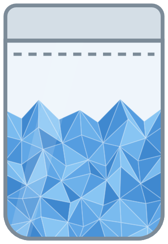
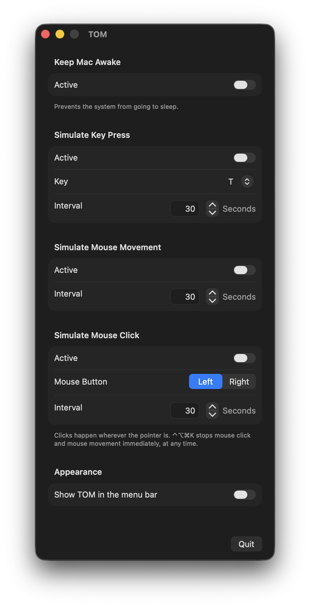

# TOM – Tuco on Meth



A small macOS utility with a window and an optional menu bar icon. Four independent functions:

- **Keep Mac Awake** – uses an IOKit power assertion to stop the display and the system from going to sleep. No special permission required.
- **Simulate Key Press** – sends a real key press via `CGEvent` at a chosen interval (1–600 seconds). Pick the key from a list (letters, numbers, arrow keys, special keys such as Space/Return/Control, and F13–F19); the labels follow the active keyboard layout (QWERTZ, AZERTY, …). Starts after a 5-second countdown so you can bring the target window to the front. Handy for staying "active" in games, for example.
- **Simulate Mouse Movement** – moves the pointer one pixel and immediately back at the chosen interval. No click, no visible movement.
- **Simulate Mouse Click** – clicks with the left or right mouse button at the current pointer position at the chosen interval (0.1 s or slower). Starts after a 5-second countdown and shuts itself off automatically after 8 hours.

Safety: **⌃⌥⌘K** stops mouse click and mouse movement immediately, no matter which app is in the foreground. Mouse movement and mouse click are mutually exclusive, and their on/off states are deliberately not restored on launch — an app that starts clicking by itself after a restart would be dangerous.

The functions run independently of each other; settings are preserved across restarts.

## Languages

The interface is available in **English**, **German** and **Spanish**, selected automatically from the system language. Unsupported languages fall back to English.

To try a language without changing your system settings, launch the binary directly:

```sh
TOM.app/Contents/MacOS/TOM -AppleLanguages '(es)'
```

## Requirements

- macOS 13 (Ventura) or newer
- To build: Xcode 15+

## Building

The Xcode project is generated from `project.yml` with [XcodeGen](https://github.com/yonaskolb/XcodeGen), but the generated project is checked in as well:

```sh
open TOM.xcodeproj
```

Then build and run in Xcode (⌘R). After changing `project.yml`:

```sh
brew install xcodegen   # if not already installed
xcodegen generate
```

## Permissions

- **Keep Mac Awake:** none.
- **Key press, mouse movement and mouse click:** require the **Accessibility** permission (System Settings → Privacy & Security → Accessibility). The app asks for it the first time you switch one of them on and links straight to the right pane. Note: after rebuilding with an ad-hoc signature, macOS treats the app as new, so the permission may have to be granted again (toggle the checkbox off and on).

The app is not sandboxed — required for `CGEvent` injection.

## License

Copyright (C) 2026 NeonRost

This program is free software, released under the **GNU General Public License, version 3** (or, at your option, any later version). See the [LICENSE](LICENSE) file for details.
