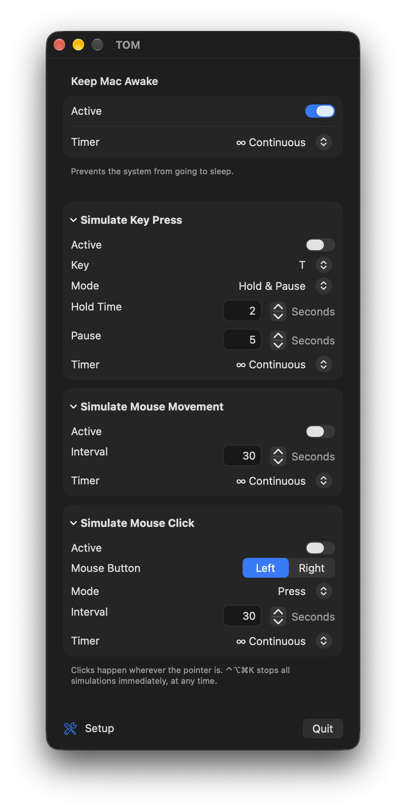

# TOM – Tuco on Meth


A small macOS utility with a window and an optional menu bar icon. Four independent functions:

- **Keep Mac Awake** – uses an IOKit power assertion to stop the display and the system from going to sleep. No special permission required.
- **Simulate Key Press** – sends a real key via `CGEvent`. Pick the key from a list (letters, numbers, arrow keys, special keys such as Space/Return/Control, and F13–F19); the labels follow the active keyboard layout (QWERTZ, AZERTY, …). Three modes: **Press** (a short press every 1–600 seconds), **Hold** (held down until you switch it off) or **Hold & Pause** (held for a set time, released for a set time, repeating). Starts after a 5-second countdown so you can bring the target window to the front. Handy for staying "active" in games, for example.
- **Simulate Mouse Movement** – moves the pointer one pixel and immediately back at the chosen interval. No click, no visible movement.
- **Simulate Mouse Click** – presses the left or right mouse button at the current pointer position, with the same three modes as the key press (clicks down to every 0.1 s). Starts after a 5-second countdown.

Every function has a **timer**: run continuously (the default), for a set duration, or until a time of day. A running function shows its end time, and the menu bar icon gets a green dot while anything is switched on.

Safety: **⌃⌥⌘K** stops key press, mouse click and mouse movement immediately, no matter which app is in the foreground, and releases any key or button TOM is holding. Mouse movement and mouse click are mutually exclusive, and their on/off states are deliberately not restored on launch — an app that starts clicking by itself after a restart would be dangerous.

The **Setup** page (bottom left of the window) holds the app-wide options: show TOM in the menu bar, hide it from the Dock, launch at login, stop mouse click after 8 hours, and **battery protection** — on battery power, TOM switches everything off once the charge drops to a level you choose. All of these are off by default.

Sections can be collapsed; settings and the collapsed state are preserved across restarts.



## Requirements

- macOS 13 (Ventura) or newer
- Apple Silicon (arm64)

## Download

Grab the latest build from the [Releases](../../releases) page — either the installer (`.dmg`: open it and drag TOM onto the Applications folder) or the `.zip` (unzip it and move `TOM.app` to your Applications folder).

The app is not notarized, so macOS will refuse to open it on first launch. Go to **System Settings → Privacy & Security**, scroll down to the message about TOM and click **Open Anyway**.

## Languages

The interface is available in **English**, **German** and **Spanish**, selected automatically from the system language. Unsupported languages fall back to English.

To try a language without changing your system settings, launch the binary directly:

```sh
TOM.app/Contents/MacOS/TOM -AppleLanguages '(es)'
```

## Permissions

- **Keep Mac Awake:** none.
- **Key press, mouse movement and mouse click:** require the **Accessibility** permission (System Settings → Privacy & Security → Accessibility). The app asks for it the first time you switch one of them on and links straight to the right pane. Note: after rebuilding with an ad-hoc signature, macOS treats the app as new, so the permission may have to be granted again (toggle the checkbox off and on).

The app is not sandboxed — required for `CGEvent` injection.

## Building

Requires Xcode 15 or newer.

The Xcode project is generated from `project.yml` with [XcodeGen](https://github.com/yonaskolb/XcodeGen), but the generated project is checked in as well:

```sh
open TOM.xcodeproj
```

Then build and run in Xcode (⌘R). After changing `project.yml`:

```sh
brew install xcodegen   # if not already installed
xcodegen generate
```

## Support

TOM is free and always will be. If it saved you some hassle, you can [buy me a coffee](https://ko-fi.com/neonrost).

## License

Copyright (C) 2026 NeonRost

This program is free software, released under the **GNU General Public License, version 3** (or, at your option, any later version). See the [LICENSE](LICENSE) file for details.
